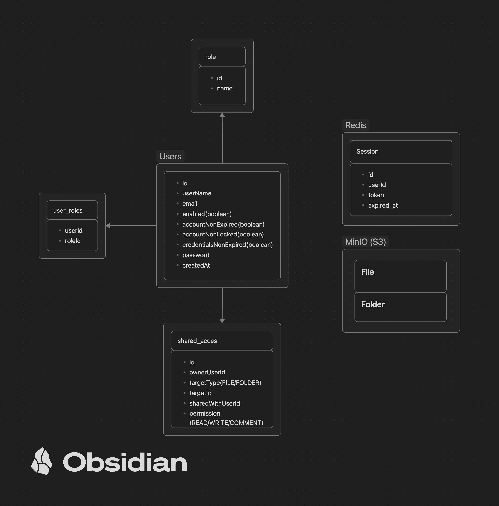

# CloudBox - Облачное хранилище файлов

## Обзор архитектуры

### Components:
- **PostgreSQL**: Аутентификация и авторизация пользователей
- **Redis**: Управление сессиями
- **MinIO (S3)**: Хранение файлов (File) и папок (Folder)

## Database Schema

### PostgreSQL Tables:
- `users` - Учетные записи пользователей с полями Spring Security
- `roles` - User roles (ROLE_USER, etc.)
- `user_roles` - Many-to-many взаимосвязь между users и roles